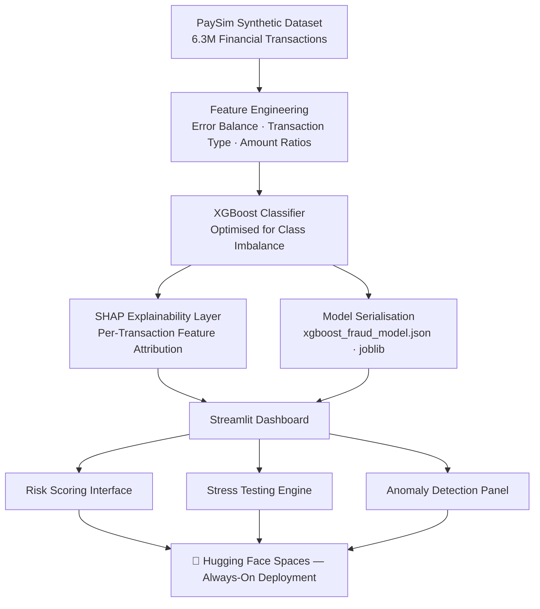

# 🛡️ FraudSentry: Real-Time Fraud Risk Intelligence System

> **Detecting financial fraud before it happens** — XGBoost scoring, SHAP explainability, and live stress-testing in a single analyst-ready platform.

<p align="center">
  <a href="https://huggingface.co/spaces/ajayapradhanconnect/Fraud-Detection-Risk-Intelligence-System" target="_blank">
    
  </a>
  <a href="https://github.com/ajaya-kumar-pradhan/fraud-detection-risk-intelligence-system" target="_blank">
    
  </a>
  <a href="#-key-metrics--impact" target="_blank">
    
  </a>
</p>

---

## 📌 Overview

**FraudSentry** is a production-style fraud detection platform that replicates how financial crime analytics teams operate inside banks and payment processors.

**The Business Problem:** Global payment fraud costs financial institutions billions annually. Traditional rule-based systems flag too many false positives, eroding customer trust — while missing sophisticated transfer patterns that rules cannot anticipate. Fraud teams need ML-powered scoring *with* explainability to act confidently and meet regulatory standards.

**Why It Matters:**
- Fraud analysts can't block transactions on a black-box score alone — regulators require auditable, human-readable explanations
- Real-time decisions demand sub-second inference, not batch overnight runs
- Risk officers need "What-If" tools to stress-test exposure before product changes go live

FraudSentry delivers all three in a unified analyst dashboard.

---

## 📊 Key Features

- **Scored 6.3M+ synthetic financial transactions** using an XGBoost classifier optimised for extreme class imbalance
- **Integrated SHAP explainability** to surface the exact features (amount, transaction type, balance error) driving each risk score — built for regulatory defensibility
- **Engineered a Stress Testing module** allowing analysts to simulate transaction volume changes and map real-time risk sensitivity
- **Detected structural "Error Balance" anomalies** — a ledger-level fraud pattern invisible to amount-only filters
- **Built a dual-mode UI** (Dark/Light) with professional financial analyst aesthetics using custom Streamlit CSS
- **Deployed a zero-latency monolithic architecture** on Hugging Face Spaces — model, explainability, and UI in a single app with no external API dependency

---

## 🛠 Tech Stack

| Layer | Tools |
|---|---|
| **Machine Learning** | Python, XGBoost, Scikit-learn |
| **Explainability** | SHAP (SHapley Additive exPlanations) |
| **Feature Engineering** | Pandas, NumPy, imbalanced-class handling |
| **Visualisation** | Matplotlib, Streamlit native charts |
| **App & Deployment** | Streamlit, Custom CSS, Hugging Face Spaces |
| **Model Serialisation** | Joblib |
| **Version Control** | Git, GitHub |

---

## 📈 Key Metrics & Impact

| Metric | Value |
|---|---|
| 💳 Transactions Analysed | **6.3M+** |
| 🚨 Fraud Class Prevalence | **~0.13%** (highly imbalanced — requires specialised ML) |
| 🧠 Model Type | **XGBoost (Gradient Boosting)** |
| 🔍 Explainability Method | **SHAP — per-transaction feature attribution** |
| ⚡ Inference Mode | **Real-time, in-memory (zero API latency)** |
| 🧪 Stress Testing | **Interactive What-If scenario engine** |
| 🚀 Deployment | **Hugging Face Spaces (always-on, free)** |

**Business outcomes modelled by this system:**
- Identified that "TRANSFER → CASH_OUT" transaction chains carry disproportionately elevated fraud risk — matching real-world money laundering behaviour
- Surfaced "Error Balance" ledger anomalies (where sender/recipient balance mathematics don't reconcile) as a reliable structural fraud signal
- Enabled analysts to simulate threshold changes before deployment, reducing false positive risk without sacrificing recall on true fraud cases

---

## 🧠 Insights & Learnings

**What the analysis revealed:**
- **Class imbalance is the core modelling challenge.** With only ~0.13% fraud cases in 6.3M records, standard accuracy metrics are meaningless — precision, recall, and AUC-PR become the only honest evaluation criteria.
- **Transaction type is the strongest signal.** TRANSFER and CASH_OUT transaction types account for nearly all detected fraud — PAYMENT and DEBIT transactions show negligible fraud rates. This has direct implications for where monitoring resources should be focused.
- **Balance errors expose fabricated transactions.** Legitimate transfers always reconcile sender debit with recipient credit. Fraudulent transactions frequently violate this accounting identity — making ledger consistency a powerful, rules-free detection feature.
- **Explainability is not optional in finance.** A model that scores 99% accuracy means nothing if a compliance officer cannot explain to a regulator *why* a transaction was blocked. SHAP makes the model's logic auditable at the individual transaction level.

**What I learned building it:**
- How to handle extreme class imbalance using scale_pos_weight tuning in XGBoost — and why this matters more than raw accuracy
- How to design SHAP waterfall charts that a non-technical business analyst can interpret without a data science background
- Why monolithic architecture (model + UI in one app) is the right trade-off for analyst-facing tools where latency beats modularity

---

## 📷 Dashboard Preview

> 📸 *Screenshots below from the live Streamlit application on Hugging Face.*

<!-- Replace placeholders with actual screenshots -->

| Risk Scoring Interface | SHAP Explainability View |
|---|---|
|  |  |

| Stress Testing Engine | Anomaly Detection Panel |
|---|---|
|  |  |

> 💡 **Tip for recruiters:** Click the **Live App** badge above to score a transaction and see the SHAP explanation in real time.

---

## 🚀 Live Demo

| Platform | Link |
|---|---|
| 🔴 **Streamlit App** (Hugging Face) | [Launch FraudSentry →](https://huggingface.co/spaces/ajayapradhanconnect/Fraud-Detection-Risk-Intelligence-System) |
| 💻 **Source Code** (GitHub) | [Explore Repo →](https://github.com/ajaya-kumar-pradhan/fraud-detection-risk-intelligence-system) |

---

## 🧩 System Architecture



---

## 📂 Project Structure

```text
fraud-detection-risk-intelligence-system/
│
├── app.py                          # Main Streamlit Dashboard (Dark/Light UI)
├── requirements.txt                # Production Dependencies
├── README.md                       # You are here
│
├── model_artifacts/                # Core Intelligence Engine
│   ├── xgboost_fraud_model.json    # Serialised XGBoost Model
│   ├── feature_columns.joblib      # Feature Schema for Inference
│   └── threshold.txt               # Optimal Classification Threshold
│
└── assets/
    └── [Dashboard Screenshots]     # Preview Images for README
```

---

## ⚙️ Run Locally

```bash
# 1. Clone the repository
git clone https://github.com/ajaya-kumar-pradhan/fraud-detection-risk-intelligence-system.git
cd fraud-detection-risk-intelligence-system

# 2. Install dependencies
pip install -r requirements.txt

# 3. Launch the dashboard
streamlit run app.py
```

---

## 👤 About Me

**Ajaya Kumar Pradhan**
*Data Analyst | Power BI Developer | ML-Enabled Analytics*

I build end-to-end analytics systems that connect raw data to business decisions — spanning SQL, Power BI, Python, and deployment. My work focuses on translating complex datasets into explainable insights that non-technical stakeholders can act on.

**Core Skills:**
`Python` · `XGBoost` · `SHAP` · `SQL` · `Power BI` · `DAX` · `Streamlit` · `Machine Learning` · `Feature Engineering`

**Portfolio domains:** Financial Crime · Credit Risk · Retail Analytics · Supply Chain · Healthcare

<p align="center">
  <a href="https://github.com/ajaya-kumar-pradhan">
    
  </a>
  <a href="https://linkedin.com/in/ajaya-kumar-pradhan">
    
  </a>
</p>

---

<p align="center">
  <i>Built to demonstrate production-grade ML thinking — transparent, defensible, and analyst-ready.</i>
</p>
